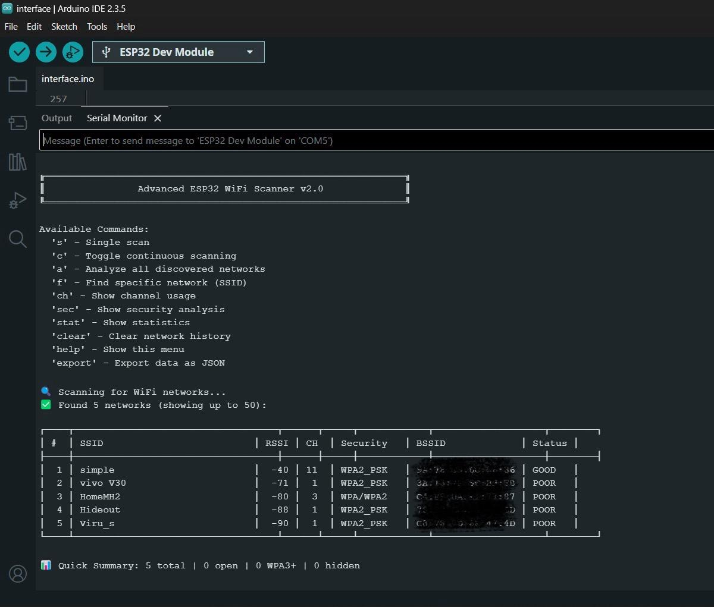

# ESP32 WiFi Scanner

ESP32 WiFi scanner with network analysis - displays SSID, BSSID, signal strength, security types, and risk assessment

## Educational Project

This project is designed for learning ESP32 programming and WiFi scanning concepts.

## Not a Laptop Alternative

This is **not designed to be a laptop alternative**. Laptops can do all of this and much more with better tools. I just wanted to learn WiFi scanning concepts and ESP32 programming through hands-on implementation.

## Features

- Real-time WiFi scanning with security analysis
- Channel usage visualization
- Signal strength categorization  
- JSON export for data analysis
- Interactive serial commands

## Quick Start

1. Upload code to ESP32
2. Open Serial Monitor (115200 baud)
3. Use commands: `s` (scan), `c` (continuous), `a` (analyze), `help` (menu)

## Commands

- `s` - Single scan
- `c` - Toggle continuous scanning  
- `a` - Analyze networks
- `ch` - Channel usage
- `sec` - Security analysis
- `export` - JSON export
- `help` - Show all commands

## Learning Objectives

- ESP32 WiFi library usage
- Network scanning concepts
- WiFi security types
- Serial communication
- Embedded programming

## License

MIT License - see LICENSE file for details.
